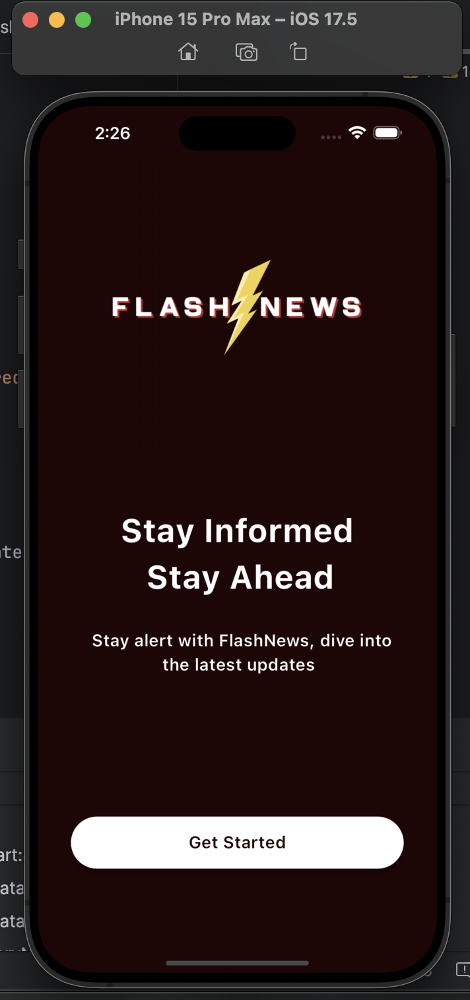

# Flash News

Flash News is a mobile application developed using Flutter that aggregates and displays news from various sources.
The app utilizes APIs from GNews API's to fetch the latest news and present it in an intuitive and user-friendly interface.

## Features

- Fetches news from multiple sources
- Categorized news sections
- Search functionality
- Bookmark articles
- Share articles with friends

## Screenshots


*Home Screen*


*News Detail Screen*


*Categories Screen*


*StartUp Screen*

## Installation

To run this app on your local machine, follow these steps:

1. Clone this repository:
   ```bash
   git clone https://github.com/ahsan668/flash-news.git
